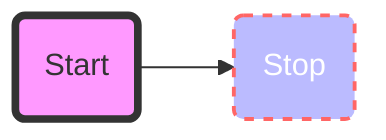
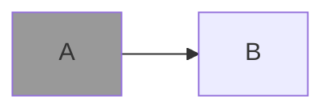
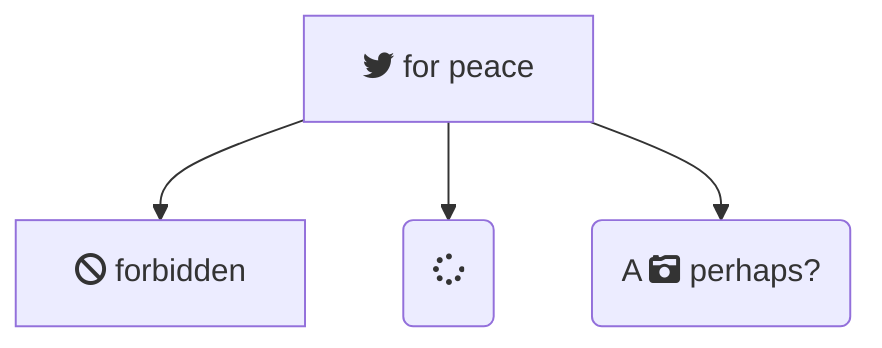
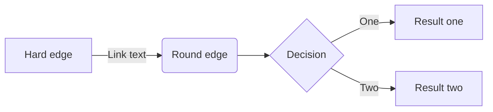

#### [Flowchart - mermaid-js](https://mermaid-js.github.io/mermaid/#/flowchart?id=an-invisisble-link)

#### [Sequence diagrams - mermaid-js](https://mermaid-js.github.io/mermaid/#/sequenceDiagram?id=sequence-diagrams)

### 填色

把A定義為class，並且對該class填色

### 符號

### 圓角

